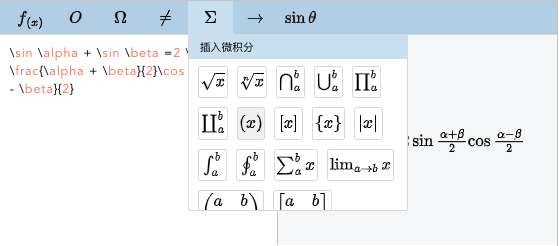
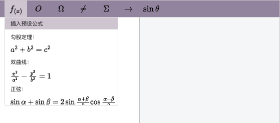

# Formula-editor


<a href="./README.md">中文</a>

## Introduction

A formula editor plugin based on Latex syntax and MathJax rendering, easy to use, supports secondary editing, and formula visualization.

Plugin Features：

1. Edit without knowing Latex syntax
2. Generate non-image type formulas, support secondary editing




## Install and Use

```html
// Container
<div id="test"></div>
```

### NPM

```bash
npm i easy-formula-editor
```

```js
import formulaEditor from 'easy-formula-editor'
const editor = new formulaEditor()
editor.create('#test')
```

### CDN

```html
<script type="text/javascript" src="../dist/formulaEditor.min.js"></script>
<script type="text/javascript">
  const editor = new formulaEditor()
  editor.create('#test')
</script>
```

### Export formula

```js
// latex
editor.latex.text()

// html
editor.$textSvgElem.html()
```

### Online example

[Formula-editor](https://codesandbox.io/s/funny-leaf-u9gso4)

## API

editor.config
| Props | Type | Description | Default |
| :------: | :--: | :---------: | :-----: |
| width | number | The editor width | 620 |
| height | number | The editor height | 272 |
| mathJaxUrl | string | CDN link for MathJax | https://lf3-cdn-tos.bytecdntp.com/cdn/expire-1-M/mathjax/3.2.0/es5/tex-svg.min.js |
| zIndex | number | z-index of the container | none |

editor.menusConfig
| Props | Type | Description | Default |
| :------: | :--: | :---------: | :-----: |
| presets | object[] | Menu preset formula | // |
| operators | string[] | Menu preset operator | // |
| greekLetters | string[] | Menu Preset Greek Letters | // |
| inequation | string[] | Menu preset inequation | // |
| AdvancedMath | string[] | Menu preset AdvancedMath | // |
| arrows | string[] | Menu preset arrow symbol | // |
| trigonometric | string[] | Menu preset trigonometric functions | // |

### Custom editor

```js
const editor = new formulaEditor()

// For example: set height
e.config.height = 400

editor.create('#test')
```

### Custom menu

```js
const editor = new formulaEditor()

// For example: adding a preset formula
editor.menusConfig.presets.push({ label: 'Custom', value: 'x+2y=7' })

editor.create('#test')
```

### Modify the style

```css
:root {
  --me-theme: #bcd4e7;
  --me-theme-light: #d0e3f2;
  --me-hover: #f1f2f4;
  --me-border: #ddd;
  --me-gray: ##666;
}
```

The editor's style uses css variables, which can be customized by modifying the corresponding values, such as：

```js
// Type in the console
var r = document.querySelector(':root')
r.style.setProperty('--me-theme', '#9b8ea9')
r.style.setProperty('--me-theme-light', '#d3ccd6')
```



### Formula color and size

The formula generated by the editor does not have its own color and font size, because it is difficult to meet various scenarios, you can control it in the following ways:

```html
<div style="font-size: 20px;color: red;">Generated formula</div>
```


### Custom menu

If you have this demand, please contact me by email: hanson247@163.com

### Internationalization

View Multilingual Document Configuration <a href="./src/utils/i18n.ts">Keys</a>

```js
const editor = new formulaEditor()
// t is the translation function of i18n
editor.t = t
editor.create('#test')
```

### Use with rich text editors

The following is an example of a menu plugin for wangeditor:
[link](https://codesandbox.io/s/funny-leaf-u9gso4)


### ⚠️ Notice

- Only one formula editor can be created at the same time, if you need to create multiple

### 📜 Changelog

Detailed changes for each release are documented in the <a href="./CHANGELOG.md">CHANGELOG.md</a>
