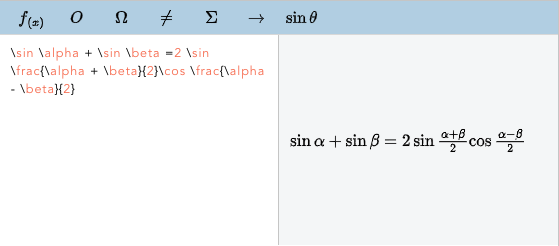
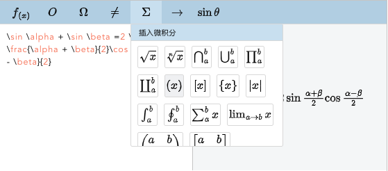
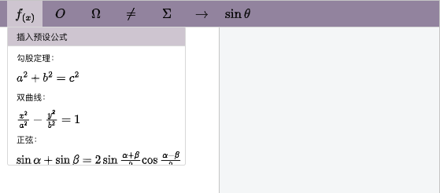
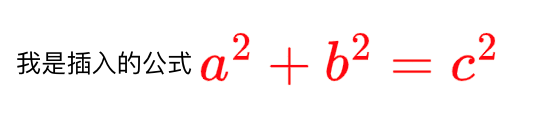
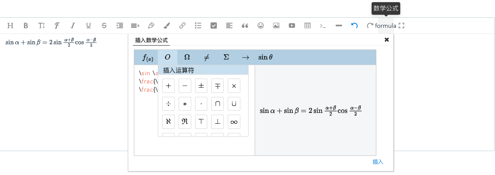

# Formula-editor


<a href="./README-en.md">English</a>

## 介绍
一款基于Latex语法和MathJax渲染的公式编辑器插件，易用、可二次编辑、内容可视化。

区别于其他插件的特色功能：
1. 无需懂Latex语法即可编辑
2. 生成非图片类型的公式，支持二次编辑




## 安装和使用
```html
// 编辑器容器
<div id="test"></div>
```
### NPM
```bash
npm i @hanson/formula-editor
```
```js
import formulaEditor from "@hanson/formula-editor";
const editor = new formulaEditor();
editor.create('#test');
```
### CDN
```html
<script type="text/javascript" src="../dist/formula-editor.min.js"></script>
<script type="text/javascript">
  const editor = new formulaEditor();
  editor.create('#test');
</script>
```

导出
```js
// latex 公式
editor.latex.text()

// html 公式
editor.$textSvgElem.html()
```

### 在线示例
[公式编辑器](https://codesandbox.io/s/funny-leaf-u9gso4)  

## 配置项
editor.config
|   属性   | 类型 | 描述 | 默认值 |
| :------: | :--: | :---------: | :-----: |
|  width  | number | 编辑器宽度 | 620 |
|  height  | number | 编辑器高度 | 272 |
|  mathJaxUrl  | string | MathJax的加载链接 | https://lf3-cdn-tos.bytecdntp.com/cdn/expire-1-M/mathjax/3.2.0/es5/tex-svg.min.js |
|  zIndex  | number | 容器的z-index | 无 |

editor.menusConfig
|   属性   | 类型 | 描述 | 默认值 |
| :------: | :--: | :---------: | :-----: |
|  presets  | object[] | 菜单预设公式 | // |
|  operators  | string[] | 菜单运算符 | // |
|  greekLetters  | string[] | 菜单希腊字母 | // |
|  inequation  | string[] | 菜单不等式 | // |
|  calculus  | string[] | 菜单微积分 | // |
|  arrows  | string[] | 菜单箭头符号 | // |
|  trigonometric  | string[] | 菜单三角函数 | // |

### 修改编辑器配置

```js
const editor = new formulaEditor();

// 例如：修改高度
editor.config.height = 400;

editor.create('#test');

```
### 配置菜单
```js
const editor = new formulaEditor();

// 例如：增加预设公式
editor.menusConfig.presets.push({ label: "自定义", value: "x+2y=7" });

editor.create('#test');

```

### 自定义风格

```css
:root {
  --me-theme: #bcd4e7;
  --me-theme-light: #d0e3f2;
  --me-hover: #f1f2f4;
  --me-border: #ddd;
  --me-gray: ##666;
}
```
编辑器颜色是通过以上的5个css变量控制，要自定义色彩搭配只需要修改对应的值，例如：
```js
// 打开控制台，输入
var r = document.querySelector(':root');
r.style.setProperty('--me-theme', '#9b8ea9');
r.style.setProperty('--me-theme-light', '#d3ccd6');
```


### 公式颜色和大小
编辑器生成的公式未自带颜色和字体大小，因为这些功能有点鸡肋，你可以通过以下方式去控制：

```html
<div style="font-size: 20px;color: red;">获取到的公式</div>
```



### 新增自定义菜单
如果你有这个需求，请联系邮箱：hanson247@163.com

### 多语言
暂未支持

### 与富文本编辑器一起使用
本项目的主要实现借鉴了[wangeditor](https://github.com/wangeditor-team/wangEditor/)，所以如果与wangeditor深度集成，可以减少60%以上的代码量。
下面示范了如何作为wangeditor的菜单插件：
